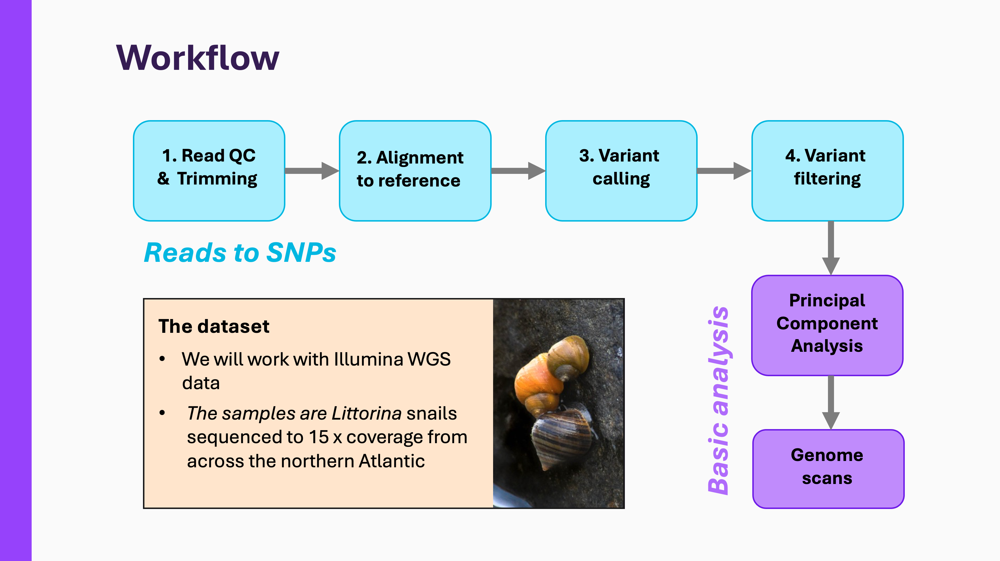

# 0.1. Welcome!

Welcome to the manual for the **variant calling** course at Natural History Museum, London (September, 2026). Here, you'll find all the exercises for our two modules - *Reads-to-SNPs* (≈ day 1 of the course) and *Basic analyses* (≈ day 2). The manual will always be available to you as a future point of reference.

!!! abstract "Learning objectives"
    By the end of this course you will be familar with:
    
    - The major steps of variant-centred analyses such as quality control, alignment, calling and filtering.
    - Standard file formats in bioinformatics such as FASTQ, SAM and VCF
    - SEAN TO ADD

## About

## Notes

We suggest that you take notes throughout the course, for which provide a [Markdown template](resources/notes.txt){ download="notes.md" }. To render Markdown, you can edit it in RStudio or VS Code. Alternatively, you can open the document in a code editor with Bash syntax highlighting, or even treat it as a plain text file.

Instead of copying-pasting, try retyping and annotating at least some of the commands yourself. There is as this is the surest way to learn!

## Lectures

Feel free to review the lecture slides at any time:

- [1.1. Read QC & trimming](slides/1.1.qc-trimming.pdf)
- [1.2. Alignment to reference](slides/1.2.alignment.pdf)
- [1.3. Variant calling](slides/1.3.calling.pdf)
- [1.4. Variant filtering](slides/1.4.filtering.pdf)

## Papers

We provide PDSs for all the papers referenced in the work. Just click on the in-text reference ([Cock et al., 2010](papers/cock2010.pdf)) to download!

## Source

This manual is built from a public repository: [github.com/SpeciationGroup/nhm-variant-calling](https://github.com/SpeciationGroup/nhm-variant-calling).
